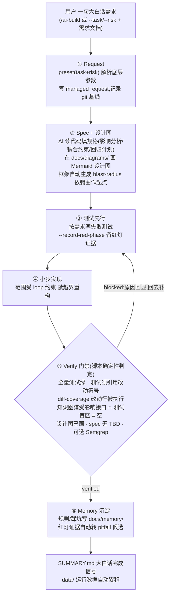

# AI Engineering Discipline

> 给"用 AI agent 写代码"的人的一层**工程纪律**——把 AI 编程从"提示词驱动、看起来对就算完成",变成"先有规格、改完必须有真测试、完成信号由机制生成而不是 AI 自己说了算"。

一条命令装进任意项目,之后用**一句大白话**就能跑完"规格 → 实现 → 验证 → 记忆"的完整闭环。框架**需要 codebase-memory 知识图谱**做影响分析(硬依赖,需本地编译,见「快速上手」;无法编译的环境用 `AI_DISCIPLINE_GRAPH_OPTIONAL=1` 关掉、回退手填),外加可选的 Semgrep 安全扫描。

---

## 主流程一图看懂(UML 活动图)



**中文说明**:整个流程的关键在 ⑤——"完成"不由 AI 自己宣称,而由框架脚本从测试、覆盖率、影响分析等**可验证证据**里算出来:`can_merge`(有无阻断)与 `coverage_complete`(该跑的是否都跑了)两个信号分开如实给。①②③④⑥ 中的智力活(读代码、填规格、画图、写测试)由 AI agent 完成,框架负责编排顺序、传递产物、把关放行;任何一步不达标,⑤ 会给出**具体到符号名的阻断原因**(如"refund_summary 受影响但没有测试守护"),AI 按原因迭代直到全绿。上图本身就是本框架"设计图先行"环节所要求的那种 Mermaid 图。

---

## 它的作用

AI 写代码最大的信任缺口是:**agent 说"做好了",但没有可信证据**。它容易不写规格直接生成、拿"看起来合理"当验证、改完不写测试、知识不沉淀。

这个框架的作用就是用**机制**(而不是更用力地提示 agent)堵住这些:

- **先补测试,再写实现,最后全量测试必须绿**——新项目按需求先建测试/单元测试;已有项目先用知识图谱定位受影响功能点/接口并补必要测试;改了业务代码但没有配套测试、测试不相关、测试命令不可运行、改动行未被测试执行,门禁都不放行。支持 Python / Go / Java / JS / TS,空测试、测错函数都拦得住。
- **实现前先画设计图**——feature / refactor / migration 任务要求先在 `docs/diagrams/` 用 Mermaid 画出关键节点(受影响/新增的类、函数及调用关系)才放行编码;框架同时自动生成改动的 blast-radius 依赖图(改动符号标橙、无测试守护标红)作起点。
- **完成信号由框架脚本生成,不靠 agent 自律**——即使 agent 嘴上说"完成了",`SUMMARY.md` 也会如实写"哪些过了、哪些没过、哪些没跑",而且是大白话。
- **动手前先有规格,且影响分析由知识图谱算**——codebase-memory 算出改动会波及的**全部**接口,交叉测试盲区,把"受影响但没测"的列出来要求先补测试,再动手。
- **踩坑和规则沉淀到 `docs/memory/`**,下次 agent 和人都能用;修 bug 留下的红灯复现证据会自动转成待沉淀的 pitfall 候选。

## 核心优点

- **完成信号可信**:can_merge / coverage_complete 由确定性脚本从测试、覆盖率、影响分析算出,AI 的解释不算证据;门禁失败时原因直接回显,大白话摘要一眼可读。
- **证据链完整**:TDD 红灯留档(`--record-red-phase`)→ diff-coverage 改动行执行核对 → 影响图 → 验证结果,每一环都落盘、可审计,红→绿的完整链条在终态报告可见。
- **一句话即可用**:用户只给 `--task`/`--risk`/需求文档(或一句大白话),Spec/Loop/Verify/Memory 的底层参数由 preset 解析,不需要学四套工具。
- **诚实降级**:知识图谱不可用会回退静态分析并在产物里标注来源(`knowledge-graph` / `static-fallback`);工具缺失记 skipped/uncovered 而非假装通过。
- **跨平台**:每个命令 `.sh`/`.bat`/`.py` 三套,CI 在 macOS / Linux / Windows 三平台矩阵验证。
- **实证数据自动累积**:每次验证的统计与问题台账写进目标项目 `data/`,框架用得越多,真实效果数据越全。
- **经过实战检验**:三轮独立 agent 实测(Python 新功能 / Python 改既有代码 / JS 修 bug),暴露的问题全部修复闭环,核心门禁连续多轮零误拦。

---

## 项目起源

这个框架始于一个观察:**AI 写代码最像"一个不写测试的开发者"**——它写得飞快,但"看起来对"和"真的对"之间没有任何关卡。

TDD(测试驱动开发)几十年前就给过答案:**先有可验证的标准,再写代码**。这恰好是治 AI"看起来对就算完成"的解药。但把 TDD 直接套到 AI 上还不够——AI 还有三个 TDD 没覆盖的毛病:

- 它**记不住上下文**:每次从零开始,重复踩同样的坑;
- 它**拿解释当证据**:"我跑过了,应该没问题"不是验证;
- 它**会无边界发散**:一个小需求改出一堆不相关的东西。

所以这个框架从 TDD 的内核出发,把它扩展成**四件必须结合、缺一不可**的事:

- **Spec** — 把 TDD 的"先有标准"扩成完整规格(目标 / 边界 / 验收标准 / 测试计划),实现前先定义清楚;
- **Verify** — 把"测试通过"做成**机制门禁**:改代码必须配套真测试,完成信号由程序生成而不是 AI 自报;
- **Memory** — 把规则、模块边界、踩坑沉淀下来,AI 和人共用,不再每次从零;
- **Loop** — 把 agent 当 stateless function,用受控的状态机管 scope、重试、退出条件。

一句话:**AI 时代的工程纪律,是把"测试驱动"扩展成"规格驱动 + 验证闭环 + 记忆沉淀 + 循环编排"——这四件事必须一起上,单独哪一件都兜不住 AI。**

---

## 快速上手

先装影响分析的硬依赖 **codebase-memory**(代码知识图谱,需本地编译,首次约十几分钟,需 C/C++ 编译器):

```bash
git clone https://github.com/win4r/codebase-memory-mcp-pro && cd codebase-memory-mcp-pro
./scripts/build.sh && mkdir -p ~/.local/bin && cp build/c/codebase-memory-mcp ~/.local/bin/
claude mcp add codebase-memory -s user -- ~/.local/bin/codebase-memory-mcp   # 可选:也让 agent 经 MCP 直接查图谱
```

再把框架装进你的目标项目(默认不覆盖已有文件):

```bash
git clone https://github.com/exgbit/ai-engineering-discipline
cd ai-engineering-discipline
./scripts/bootstrap.sh /path/to/your-project      # Windows: scripts\bootstrap.bat
```

然后在目标项目里打开 Claude Code,用**一句大白话**:

```text
/ai-build 加一个退款审批功能
```

`/ai-build` 会自动:推断任务类型 → 读你的代码、写并填规格 → 小步实现(带测试)→ 跑验证 → 全程用大白话跟你汇报。你**不需要懂下面的 Spec/Loop/Verify/Memory,也不需要填任何参数**。

> 用 Codex 也一样:框架同时装了 `.codex/skills/`。需要 Semgrep 安全扫描的话,`bootstrap.sh <target> --install-adapters` 只会装 Semgrep 这一个工具。

---

## 工作原理

每个任务走四个相连的层,**全部由框架自带的 Markdown 模板 + AI agent 实现**:

```text
Spec   → 把需求变成规格(目标 / 边界 / 验收标准 / 测试计划)
Loop   → 用受控的循环跑(scope / 重试 / 退出条件)
Verify → 用测试 + 可选 Semgrep 扫描证明结果,生成诚实的完成信号
Memory → 把规则 / 边界 / 踩坑写回 docs/memory/
```

**Verify 这一步会调 codebase-memory 算改动的影响范围**(必需:`index_repository` 建图 + `detect_changes` 算受影响接口的 blast radius,没装则门禁亮红、要求先装),并可选调用 Semgrep 安全扫描。Spec / Loop / Memory 三层是纯模板 + agent。用户面对的是"一句话 + 大白话回复",框架在背后接管步骤顺序、文件和交接,**你不用自己决定何时跑哪个工具、怎么在工具间传产物**。

完成信号分两档,都如实给:

- `can_merge`:有没有阻断项(红灯)。
- `coverage_complete`:所有该跑的检查是否都跑了;没跑的可选项(如未安装 Semgrep)会列出来。默认它会让状态保持 pending;在严格流水线里加 `--fail-on-incomplete-coverage` 可让它直接返回非零。

### 测试门禁怎么工作

开发类任务默认按严格 TDD 门禁走:

- 新项目:先建知识图谱,根据需求建立测试用例 / 单元测试,再进入开发。
- 已有项目:先建/刷新知识图谱,根据需求涉及的功能点、接口、传递影响面补必要测试用例 / 单元测试,再进入开发。
- 写完测试、改实现前,运行红灯记录: `ai_discipline.py execute . --record-red-phase`。它只跑测试命令,把预期失败输出保存到 `docs/verify/red-phase-results.json` 和 `.md`;如果测试没失败,说明没有红灯证据。
- 最后必须跑完整测试套件;没有可运行测试命令不能标记完成。

创建 managed request 时,框架会记录当时的 git `HEAD` 作为 `Change base`。后续验证按 `Change base -> 当前工作树` 的完整范围检查代码、测试、diff coverage 和影响分析,所以支持标准 TDD 历史:一个提交先加失败测试,后一个提交再写实现。

框架用 `git diff` 找出你改动的代码符号(函数 / 类名,含 JS/TS 的 `const f = () => {}` 箭头函数),再检查"改动的测试是否真的引用了这些符号":

- 改了代码、没动测试 → 拦。
- 改了测试、但测试跟改动的代码毫不相干(空测试 / 测错函数)→ 拦。
- 测试真的引用了改动的函数 / 类,且全量测试通过、必需 diff coverage 通过 → 放行(含类内方法:改方法体会归因到该方法,而不是外层类)。
- 改了业务代码但知识图谱返回的受影响接口为空 → 拦。这个结果通常表示图谱没有建好、detect_changes 没覆盖到改动,或语言/结构未被索引,不能当作"无影响"。
- **设计图先行**(feature / refactor / migration 预设默认开启):框架在统一图目录 `docs/diagrams/` 自动生成本次改动的 Mermaid 依赖图(`<名字>-impact.md`)和设计图占位(`<名字>-design.md`);设计图没画(仍是 TBD 占位)→ 拦。AI 必须先画出关键节点(受影响/新增的类、函数及调用关系)再编码。门禁只查"图画了没",不判设计质量。

**回归与测试先行**:验证时跑全套测试,**全套绿 = 回归通过**(旧测试在套件里、被破坏会被抓),不再靠手填"回归计划"表;修 bug 时,改了代码就必须有真覆盖改动的测试,否则拦。

### 测试索引(旧项目换人上手)

`ai-discipline index <项目>`(或每次验证自动刷新)扫描现有测试,在 `docs/verify/test-index.md` 建一张**功能/接口 → 守护测试**的反向索引,并标出**盲区**(没有任何测试守护的函数/类)。换人接手时,看这张索引就知道"我要改的函数有哪些测试守着、哪些功能根本没测"。

### 运行数据自动沉淀

每次验证后,框架把这次的统计和遇到的问题**自动累积**到目标项目的 `data/`:

- `data/run-stats.jsonl` — 每次一行(task / can_merge / 覆盖 / 测试数 / 问题计数);
- `data/run-summary.md` — 自动刷新的汇总(可合并率、有阻断率、按任务分布…);
- `data/issues-log.md` — 阻断 / 未覆盖 / 需人工的问题台账。

框架被用得越多,`data/` 里的真实数据和问题台账越全——不用额外操作,实证数据自己攒。

---

## 仓库结构

```text
ai-engineering-discipline/
├── scripts/               # 唯一权威源:统一 CLI(ai_discipline.py)与各步脚本(.sh/.bat/.py 三套)
├── presets/               # task+risk 预设:隐藏底层框架参数(enforced/advisory 分档见 presets/README.md)
├── templates/             # 装进目标项目的模板(spec / verify-checklist / memory-entry / loop / pr)
├── framework/             # 方法论与落地文档(操作模型、loop 工程、试点手册、诚实自评)
├── adapters/              # 四件套默认选择(default-stack.json)与适配器说明
├── claude-code-commands/  # 目标项目的 slash 命令(/ai-start /ai-build /ai-verify ...)
├── claude-code-skills/    # Claude Code skill 副本(由 sync_skills.py 从顶层自动生成,勿手改)
├── skills/                # Codex skill 副本(同上,自动生成)
├── examples/              # loop runbook / test matrix / 项目记忆示例
├── data/                  # 指标 schema 与合成示例数据(对外引用前换成真实 pilot 数据)
├── tests/                 # 门禁与核心逻辑的单元测试(unittest)
└── .github/workflows/     # 三平台冒烟、Windows bat、lint、副本同步校验
```

改 `scripts/`、`presets/`、`templates/` 后跑 `python scripts/sync_skills.py` 重新生成两份 skill 副本;装进目标项目后,产物统一落在目标项目的 `docs/`(specs / diagrams / verify / memory / loops / reports)与 `data/` 下。

---

## 诚实的能力边界

这个框架刻意只承诺它能兑现的:

- **影响分析依赖 codebase-memory 这个外部知识图谱(硬依赖,需本地编译)。** 框架调它算 blast radius(改动波及哪些接口),没装则门禁红灯(用 `AI_DISCIPLINE_GRAPH_OPTIONAL=1` 可关、回退手填影响分析)。静态图谱**看不见**动态分派 / 反射 / 回调 / 依赖注入 / 事件调用;它给的是"哪些接口受影响"的强信号,不是完备证明,框架也不验证图谱质量。
- **测试门禁 / 索引先做"测试有没有引用改动符号"的检查,再用 diff coverage 做改动行执行检查。** 符号门禁拦得住"完全不写测试""空测试""测错函数";但一个引用了改动符号、断言却没意义的测试,理论上还能过。**它防的是无意的偷懒,不是蓄意的绕过。** 同理,索引的"守护"只表示测试文本里出现了符号名,盲区是"很可能没测"的强信号而非证明。开发类任务(feature / bugfix / refactor / migration)默认要求 `require_diff_coverage`:需要覆盖率工具(coverage.py / c8 / go cover / jacoco)跑覆盖率并和改动行交叉;覆盖率工具不可用、或改动行未被执行,都不能标记完成。**Python / Go / JS 已端到端验证(覆盖率工具真跑、精确定位未覆盖的改动行),Java 解析就绪(配了 jacoco 即生效)。**
- **回归 = "现在全套测试绿",不是"对比改动前 baseline 无行为变化"。** 覆盖差的套件可以全绿却仍回归未测的行为;test-first 对 bugfix 只验"有测试覆盖改动",不验"测试先于代码失败过"(框架单次执行,无时序信号)。
- **智力活(读代码、填规格、判断影响)是 AI agent 做的,框架不读代码语义。** 框架提供的是纪律和门禁,质量上限取决于你用的 agent。脱离 Claude Code / Codex 这类能执行的 agent,它就只是一套模板。
- **指标数据是合成示例。** `data/` 里的采用指标是占位样本,对外引用前请换成你自己的真实 pilot 数据。
- **单租户、纯本地文件 + CLI。** 没有云端、没有多租户 / 权限模型。适合个人和小团队,不是企业级治理平台。

---

## 适合谁

**适合**:用 Claude Code 或 Codex、做**需要长期维护**的项目、且怕 AI 偷懒糊弄的个人或小团队;也适合当团队"AI 协作 SOP"的起点。

**不那么适合**:一次性脚本 / 原型(纪律开销 > 收益);已有成熟 CI(Semgrep diff-aware + SonarQube + 必过测试)的公司质量链路(增量有限)。

---

## 深入阅读

- [`USAGE.md`](USAGE.md) — 完整 CLI 用法(`start` / `request` / `run` / `execute` / `verify` / `report` / `config` / `metrics` / `doctor` / `index`)、单步调试、CI 集成、已有需求文档的接入。
- [`framework/integrated-workflow.md`](framework/integrated-workflow.md) — 一键背后的编排设计。
- [`framework/framework-assessment.md`](framework/framework-assessment.md) — 架构、当前限制、要证明价值还需要的数据(诚实自评)。
- [`framework/integration-levels.md`](framework/integration-levels.md) — 工具名归属与商标声明。
- [`CONTRIBUTING.md`](CONTRIBUTING.md) — 改动须知(`scripts/` 是 skill 副本的唯一权威源,改后跑 `sync_skills.py`)。
- 装进目标项目后,`CLAUDE.md` / `AGENTS.md` 是给 agent 的完整操作协议。

---

## 关于工具名

框架的 Spec / Loop / Memory 模板在风格上参考了 GitHub Spec Kit、LangGraph、Mem0,但**框架不调用它们,也不需要安装**——它们只是模板的风格参照。运行期真正调用的外部工具是 **codebase-memory**(影响分析,必需)和 Semgrep(安全扫描,可选)。本项目独立,与上述项目无隶属或背书关系。

## 作者

作者:果比AI · [guobi.ai](https://guobi.ai)

## License

[MIT](LICENSE) © 2026 果比AI (guobi.ai)
